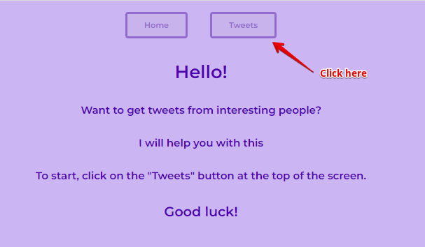
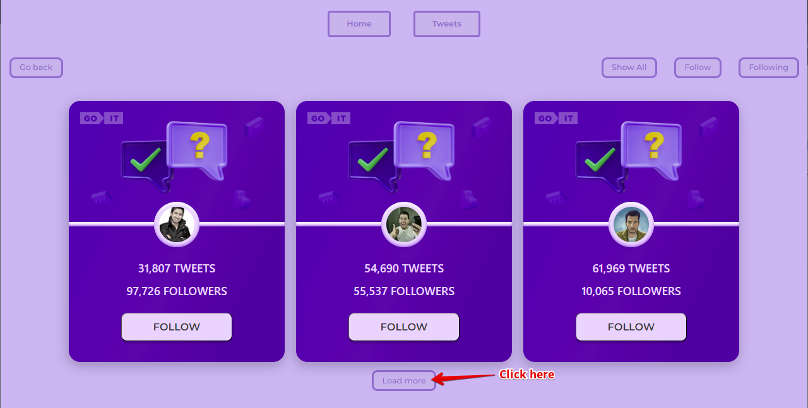
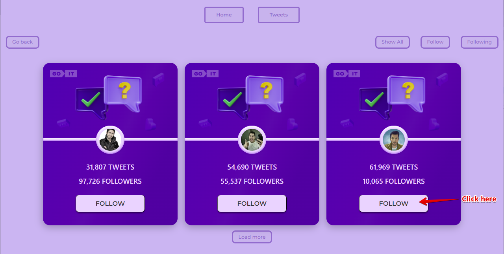
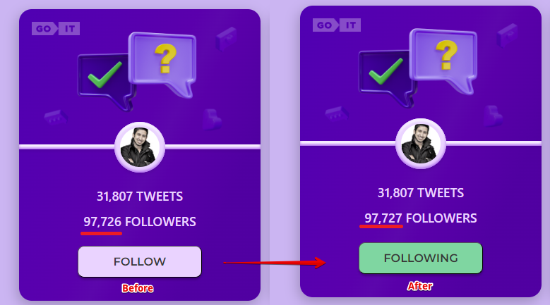
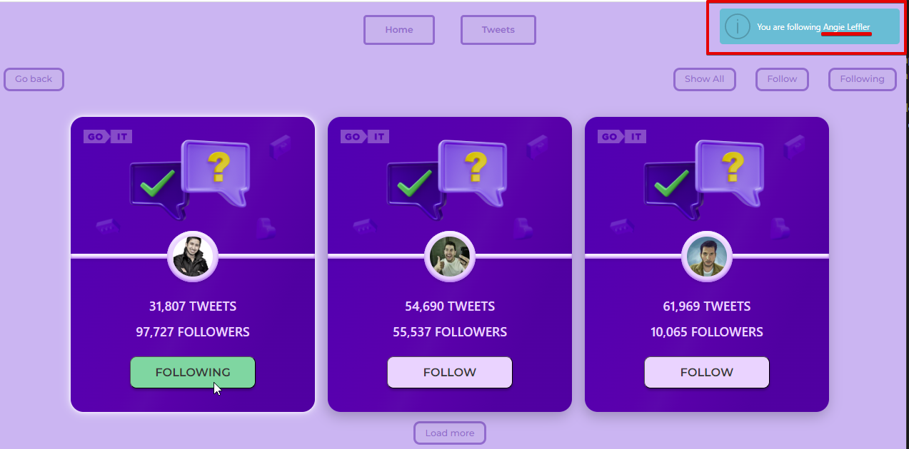
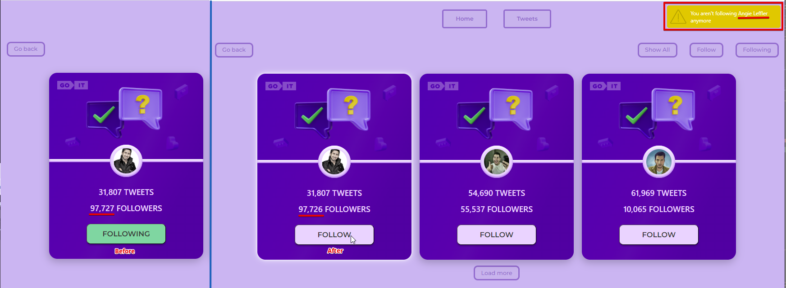
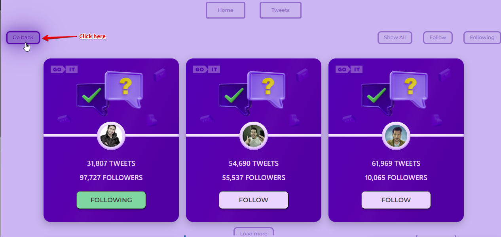

# Hi!

This application is designed for those who want to track the tweets of people
they are interested in.

In order to find interesting people and start tracking their tweets, you need to
click on the "Tweets" button on the Home page. 

## To start following

Choose the person you are interested in from the list. To expand the list, click
the "Load more" button

 and click "Follow".

## Successful "follow"

After clicking on the "Follow" button, the button text will change to
"Subscribe" and the background color will change to green.

You will also receive a notification that you are following a user with the
corresponding username. The notification will be located in the upper right
corner of the screen.

### Control your follow

You can manage your subscription using the buttons:

- "Show all" button to display all possible cards of people;
- Follow button to display all cards of people you don't follow.
- "Subscriptions" button to display all the cards of the people you follow.
  

### Stop following

To stop following the user you need click on the "following" button. After that,
the quantity of followers this user will decrease by one, the background of the
button will change gray and the inscription will change to "Follow".

You will also receive a notification that you are not following a user anymore
with a matching username. The notification will be located in the upper right
corner of the screen.

### Return to Home page

To return to the Home page, you  need to click on the "Go back" button located in the upper left corner of the screen.

