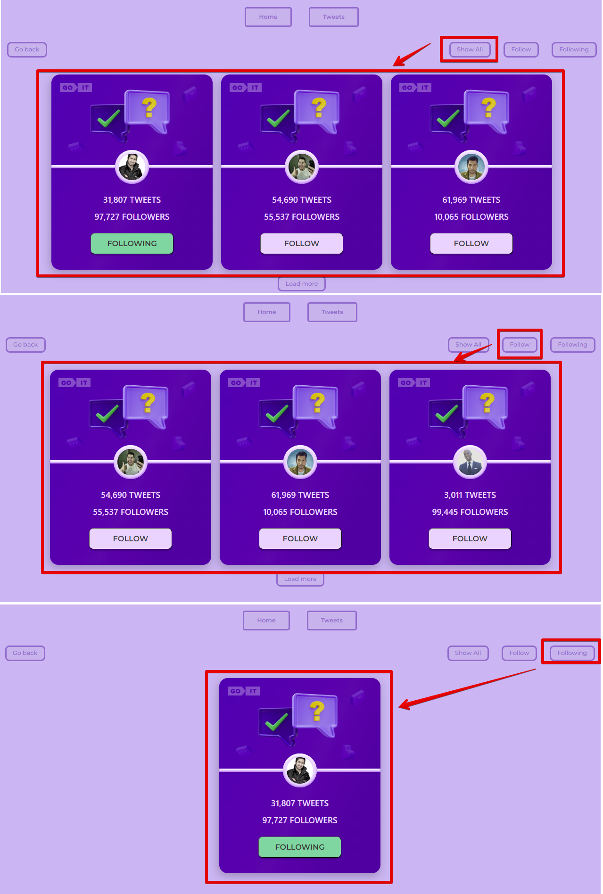

# Hi!

This application is designed for those who want to track the tweets of people
they are interested in.

In order to find interesting people and start tracking their tweets, you need to
click on the "Tweets" button on the Home page. 

## To start following

Choose the person you are interested in from the list. To expand the list, click
the "Load more" button

 and click "Follow".

## Successful "follow"

After clicking on the "Follow" button, the button text will change to "Subscribe" and the background color will change to green..

You will also receive a notification that you are following a user with the corresponding username. The notification will be located in the upper right corner of the screen.

### Control your follow

You can manage your subscription using the buttons:
    - "Show all" button to display all possible cards of people;
    - Follow button to display all cards of people you don't follow.
    - "Subscriptions" button to display all the cards of the people you follow.

### Control your follow

You can manage your subscription using the buttons:
    - "Show all" button to display all possible cards of people;
    - Follow button to display all cards of people you don't follow.
    - "Subscriptions" button to display all the cards of the people you follow.

